# FreakShow

**Your stream. Your rules. One place to control the whole show.**

FreakShow is a self-contained Windows overlay control center built for creative, interactive
streams. It brings videos, images, notes, viewer effects and external web overlays together in one
clean browser interface, while a transparent output window places everything exactly where it
belongs on screen.

Connect it to [Streamer.bot](https://streamer.bot/) to turn chat messages, rewards and custom events
into instant on-stream reactions. The control page works locally or across your home network, so
the show can be prepared, adjusted and triggered from another PC without interrupting the game.

## Download

Ready-to-run Windows packages are available under **[Releases](../../releases)**. Download the
newest `FreakShow-<version>-windows-x64.zip`, extract the complete folder and read the included
`README-FIRST.txt` before starting `FreakShow.exe`.

## Automatic updates

Open the FreakShow tray menu and select **Check for updates**. FreakShow downloads the smaller
`FreakShow-update-<version>.zip`, verifies its SHA-256 checksum, closes, replaces the program files
and restarts automatically. A separate update helper performs the locked EXE replacement and keeps
a rollback copy. `Content/`, `data/`, `Logs/` and `WebView2UserData/` are blocked from the updater and
are never overwritten. Installation remains a deliberate user action; FreakShow never installs an
update silently.

## Documentation

- **[Deutsches Handbuch](docs/DE.md)** — setup, every workspace, settings and operation
- **[Connections](docs/CONNECTIONS.md)** — Streamer.bot, LAN, external overlays, Twitch and ACT
- **[Troubleshooting](docs/TROUBLESHOOTING.md)** — common startup, preview and connection issues

## Features
- **Video overlays** — per-video custom triggers, chroma-key, trim, volume, group random-trigger
- **Image / GIF overlays** — trigger, tint, free positioning
- **Notes (cheat-sheet)** — mini-markdown (headings, tables, lists, emoji) + background image
- **Emote rain** ("red carpet")
- **External overlay links** with live preview (Streamlabs, GIPHY, ChatRD, …)
- **Server-side UI state** synced across multiple browsers / PCs — no cookies or per-browser storage
- **LAN access** with an IP allow-list, a real Streamer.bot host-status indicator, and a WebSocket
  relay for HTTPS overlays
- **Global Windows hotkey** to toggle the overlay output (works while a game is focused)
- **One-click updates** with SHA-256 verification, protected user data and automatic rollback
- UI available in **German / English / Spanish**

## Requirements
| Need | Notes |
|------|-------|
| **Windows 10 / 11** | 64-bit |
| **WebView2 Runtime** | Pre-installed on current Windows; otherwise [download it](https://developer.microsoft.com/microsoft-edge/webview2/) |
| **.NET Framework 4.x** | Ships with Windows — no separate SDK needed |
| **Streamer.bot** (optional) | Only needed for triggers/chat/rewards |

## ⚠️ No media included
For copyright reasons this repository ships **no** images, videos, backgrounds or icons. Put your
**own** media under `Content/` (e.g. `Content/media/videos/`, `Content/backgrounds/`,
`Content/images/`). The folder structure is created on demand.

## Tips for smooth operation (please read)
- **Run only one instance**, and not alongside an older overlay/bridge — port **18081** must be free.
- **Firewall / LAN:** to reach the control page from another PC or phone, allow the app through
  Windows Firewall on your **private** network. Then add that device under *Settings → Connections →
  Allowed devices* (empty list = everyone on the LAN is allowed; this PC is always allowed).
- **Streamer.bot:** enable its **WebSocket Server**, then set the host/IP + port under *Settings →
  Connections*. The host-status shows the real connection of the overlay PC on every device.
- **Videos are not all preloaded** — only the currently selected video is loaded. Keep it that way;
  a large library (hundreds of MB) would otherwise hammer memory and disk.
- **Known HTTPS overlays** such as ChatRD, Tawmae and MustachedManiac use a fileless preview relay.
  FreakShow fetches their page into memory, inserts the centrally saved Streamer.bot connection and
  writes no local HTML copy. Unknown providers remain direct links and may still be subject to the
  browser's mixed-content rules.
- **Editing shared state from two tabs/PCs at once** is fine — state is merged per key. After a fresh
  deploy, open your **main** browser first so it seeds the shared state from its own saved data.
- **SmartScreen:** the EXE is a self-built, unsigned binary — Windows may warn on first run.

## Build
```powershell
./Build.ps1
```
`Build.ps1` compiles the EXE with the Windows .NET Framework compiler (`csc.exe`) that ships with
Windows. `EmbeddedBridge.ps1` is embedded as a resource, so changes to **`Host.cs`** or
**`EmbeddedBridge.ps1`** need a rebuild; files under `app/` and `Content/` take effect after a
page / overlay reload.

`Build.ps1` also creates `FreakShowUpdater.exe`. To prepare both the complete installer and the
smaller automatic-update asset for a release, set the version in `VersionInfo.cs`,
`UpdaterVersionInfo.cs`, `VERSION.txt` and `README-FIRST.txt`, then run:

```powershell
./Create-UpdatePackage.ps1 -Version 1.1.1 -WriteRepositoryManifest
```

Upload both ZIP files plus `SHA256SUMS.txt` to the matching GitHub release and commit the generated
`update-manifest.json` only after the assets are available.

## Run
Start `FreakShow.exe` (overlay + bridge start together). Open settings by double-clicking the
**tray icon** (opens `http://127.0.0.1:18081/`). Quit from the tray menu.

## Screenshots

| Videos | Notes |
|---|---|
| 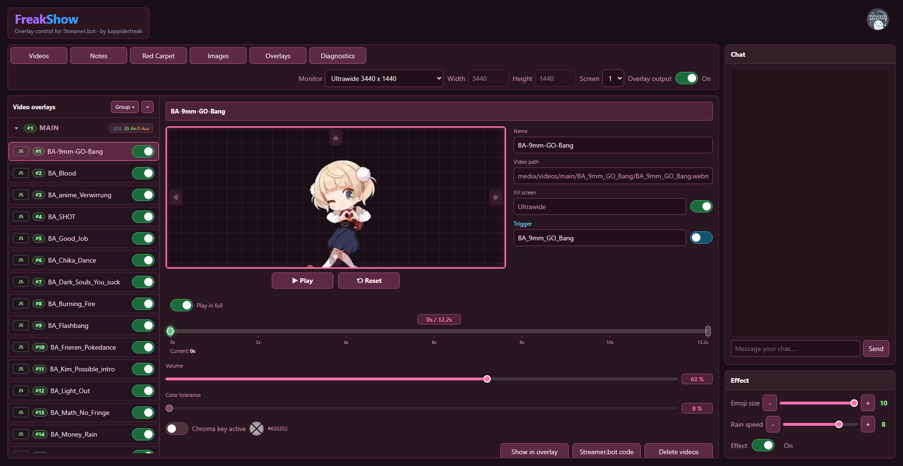 | 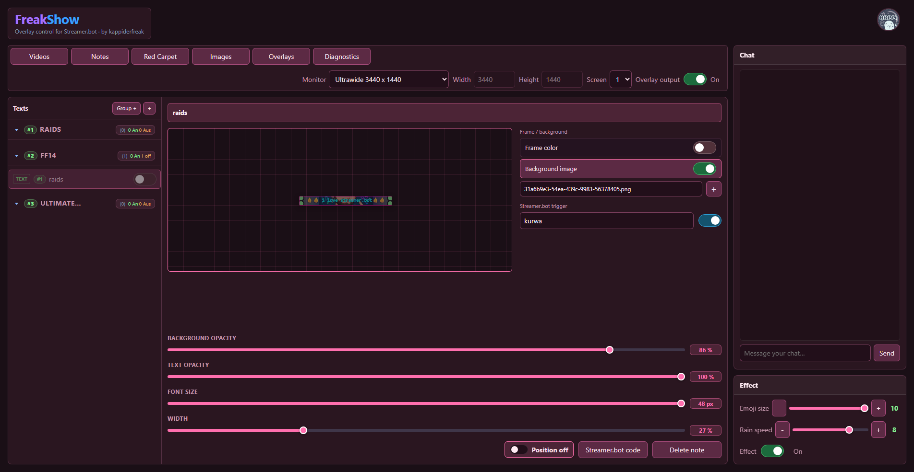 |

| Images | Red Carpet |
|---|---|
| 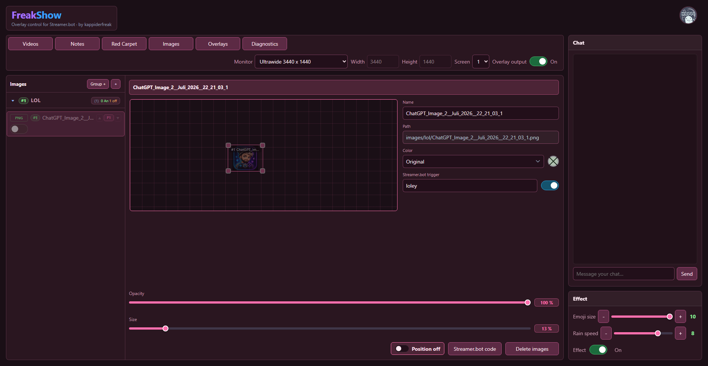 | 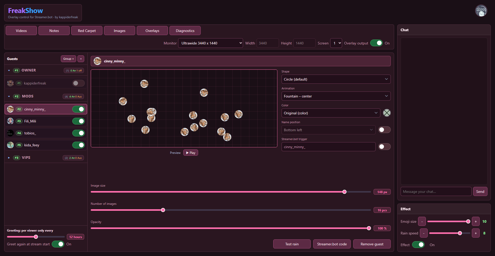 |

| External overlays |
|---|
| 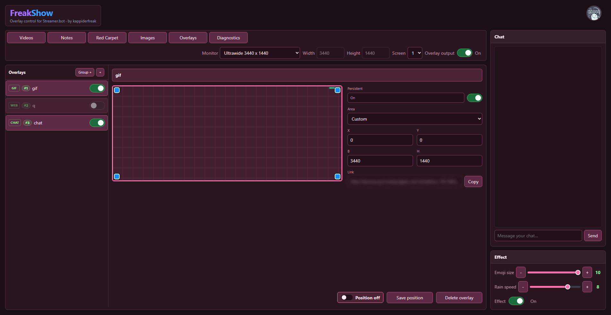 |

### Note formatting (right-click menu)
Right-click selected text in a note to format it — **bold / italic / underline / strikethrough**,
insert **Streamer.bot variables**, apply **markdown** (headings, lists, tables) and drop in **emoji**:

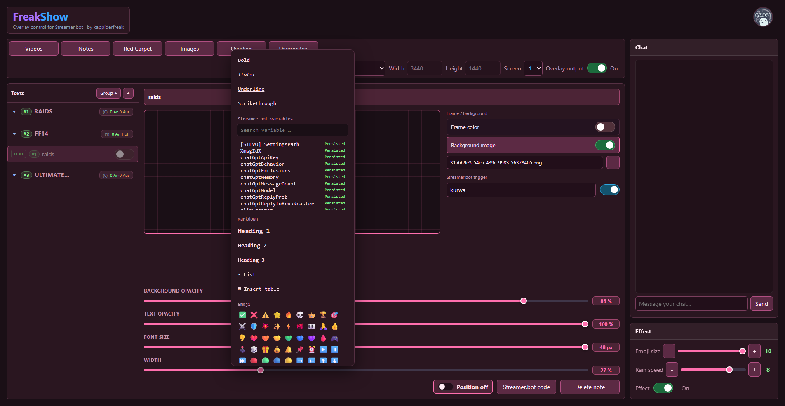

### Diagnostics · Diagnose

| 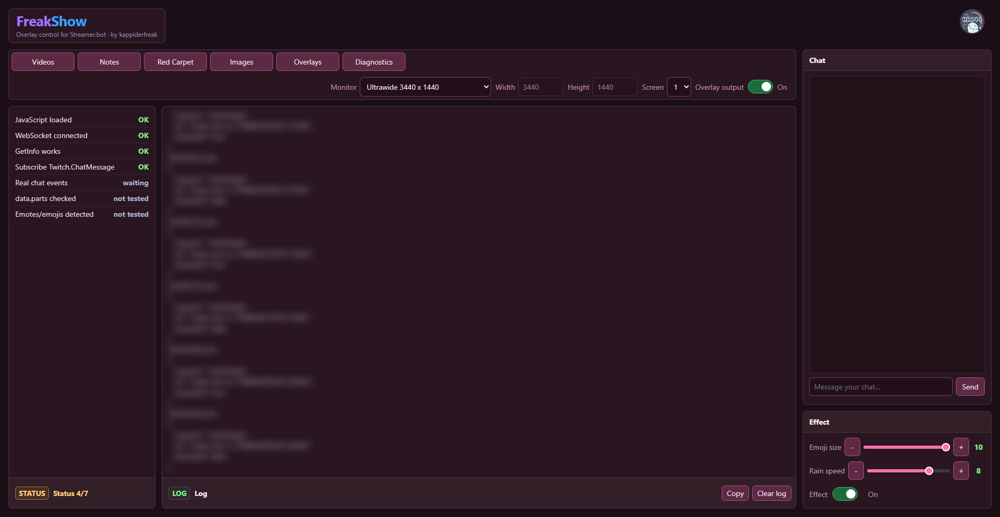 |
|---|

### Settings · Einstellungen
Six panels in the settings flyout (tray icon) · Sechs Panels im Einstellungen-Flyout (Tray-Symbol):

| Appearance · Darstellung | Pause |
|---|---|
| 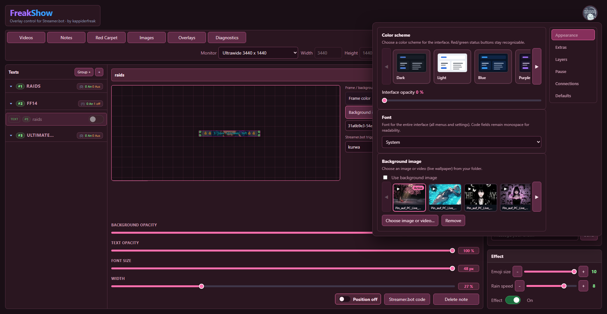 | 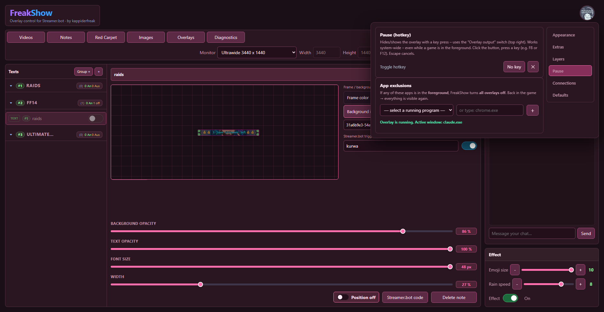 |

| Layers · Ebenen | Connections · Verbindungen |
|---|---|
| 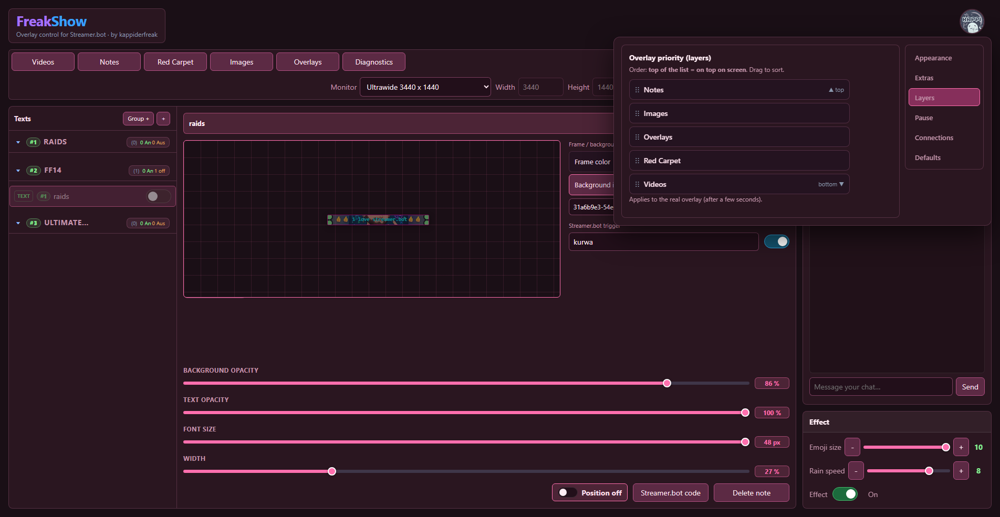 | 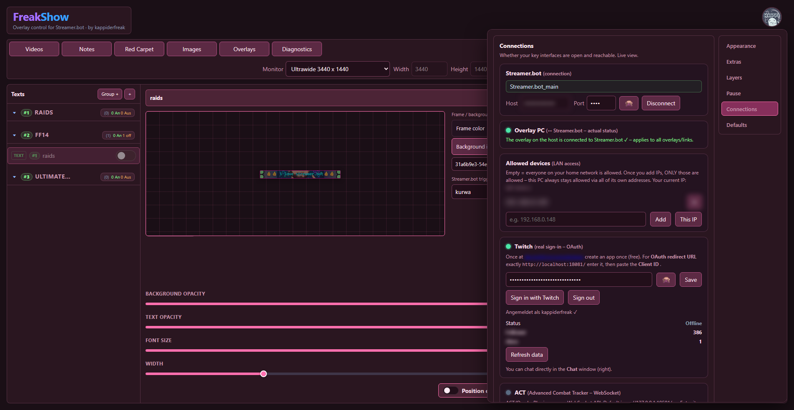 |

| Extras | Defaults · Standard |
|---|---|
| 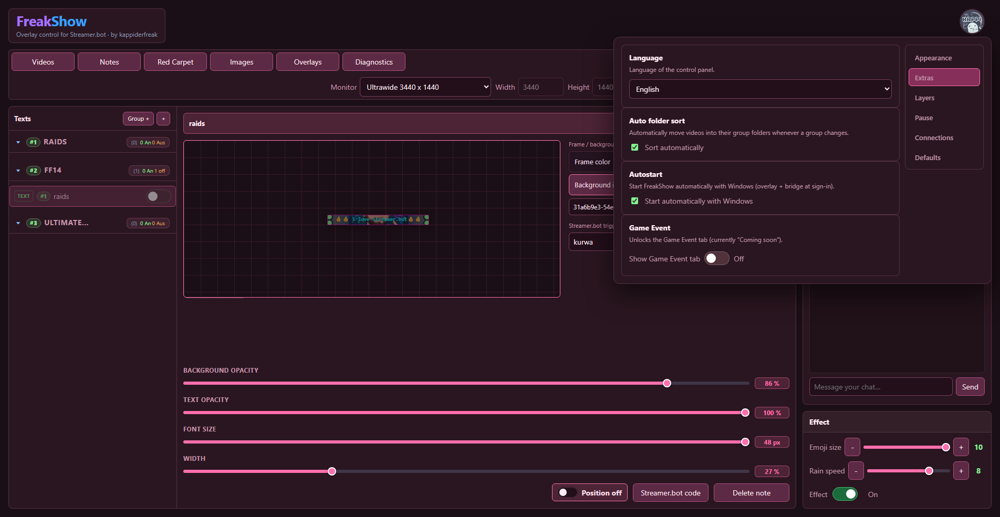 | 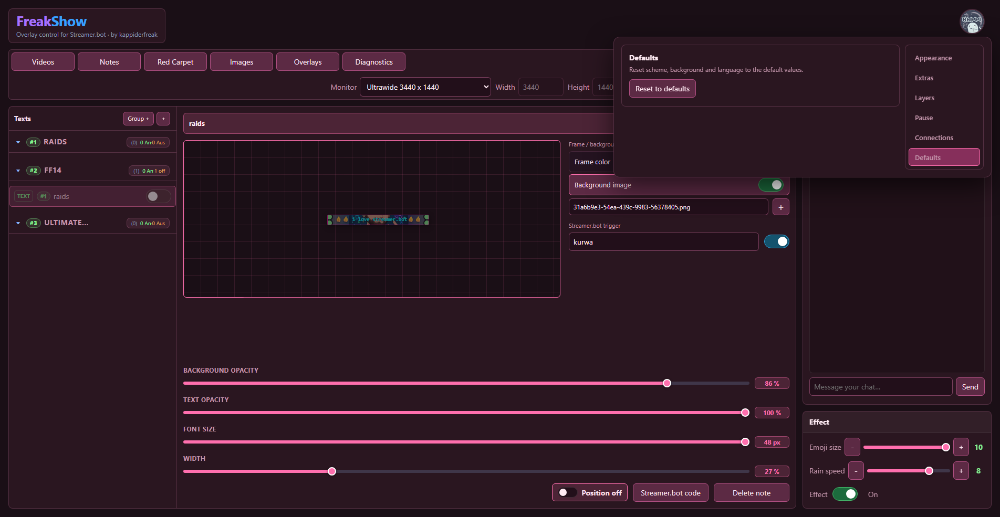 |

📖 **Beschreibung jedes Screenshots (DE + EN) · Description of every screenshot (DE + EN):**
see [`docs/images/`](docs/images/).

Alle Screenshots im Pink-Theme; sensible Daten (IPs, Log) sind verpixelt. · All screenshots use the
pink theme; sensitive data (IPs, log) is blurred. Personal media and private configuration values
are not included in this repository.

## License
[MIT](LICENSE). Includes the redistributable Microsoft WebView2 SDK DLLs. Do not redistribute
third-party copyrighted media through this repository.
