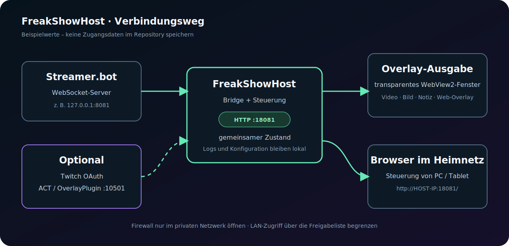

# Verbindungen einrichten

## Ports und Rollen

| Dienst | Typischer Wert | Aufgabe |
|---|---:|---|
| FreakShowHost | HTTP `18081` | Steuerungsseite, Bridge und lokale API |
| Streamer.bot | WebSocket `8081` | Events, Trigger, Chat und Variablen |
| ACT/OverlayPlugin | WebSocket `10501` | optionale Spieldaten |

Andere Ports sind möglich. Wichtig ist, dass Server und FreakShow denselben Wert verwenden.

## Streamer.bot

### 1. WebSocket-Server aktivieren

In Streamer.bot den WebSocket-Server öffnen, aktivieren und den verwendeten Port notieren. Im Standardbeispiel ist das `8081`.

- FreakShow und Streamer.bot auf demselben PC: Host `127.0.0.1`.
- Streamer.bot auf einem anderen PC: lokale IPv4-Adresse dieses PCs, zum Beispiel `192.168.1.50`.
- Ein WebSocket-Passwort nur dort eintragen, wo FreakShow beziehungsweise das verwendete Widget es ausdrücklich unterstützt.

### 2. FreakShow verbinden

1. In FreakShow oben rechts die Einstellungen öffnen.
2. **Verbindungen → Streamer.bot** auswählen.
3. Host und Port eintragen.
4. **Verbinden** anklicken.
5. Auf den grünen Status **Overlay-PC ↔ Streamer.bot** achten.

Der Hoststatus wird von der echten Overlay-Ausgabe gemeldet. Er ist zuverlässiger als eine Vorschau in einem entfernten Browser.

### 3. Trigger verwenden

1. Beim Video, Bild, Emoji-Regen oder der Notiz einen eindeutigen Triggernamen vergeben.
2. Den Trigger-Schalter aktivieren.
3. Optional **Streamer.bot-Code** anklicken.
4. In Streamer.bot eine Action erstellen.
5. Unter **Core → C# → Execute C# Code** den erzeugten Code einfügen und kompilieren.

Bei Video-Gruppen kann der Würfelmodus einen Gruppentrigger erzeugen. Dann wird ein zufälliger aktiver Eintrag der Gruppe abgespielt.

## Variablen in Notizen

Das Kontextmenü des Notizeditors kann verfügbare Streamer.bot-Variablen einfügen. Der Platzhalter wird beim Auslösen mit dem vom Event gelieferten Wert ersetzt. Wenn eine Variable unverändert als Platzhalter erscheint, prüfen:

- Ist Streamer.bot verbunden?
- Liefert die verwendete Action die Variable tatsächlich mit?
- Stimmen Groß-/Kleinschreibung und Variablenname?
- Wurde die Notiz nach der Änderung erneut ausgelöst?

## Zugriff von einem zweiten PC

1. Die IPv4-Adresse des FreakShow-PCs ermitteln, beispielsweise `192.168.1.20`.
2. Auf dem zweiten Gerät `http://192.168.1.20:18081/` öffnen.
3. Falls nötig FreakShow in der Windows-Firewall ausschließlich für **private Netzwerke** erlauben.
4. Unter **Verbindungen → Erlaubte Geräte** die IP des zweiten Geräts hinzufügen.

Eine leere Freigabeliste erlaubt grundsätzlich alle Geräte im Heimnetz. Sicherer ist eine explizite Liste der tatsächlich verwendeten Geräte. Der lokale Host bleibt erreichbar.

## Externe Overlays

FreakShow erkennt bekannte URL-Formate und kann die gespeicherte Streamer.bot-Adresse ergänzen.

| Profil | Parameter |
|---|---|
| Tawmae-Overlays | `address`, `port`, optional `password` |
| ChatRD | `streamerBotServerAddress`, `streamerBotServerPort` |
| Generisch | `host`/`port`, `server`/`port`, `ip`/`port` oder WebSocket-URL |
| Cloud-Widget | keine lokalen Parameter, wenn der Anbieter seine eigene Cloud-Verbindung nutzt |

Die automatische Erkennung kontrollieren, bevor ein Link gespeichert wird. Persönliche Widget-IDs und Tokens sind Zugangsinformationen und dürfen nicht in Screenshots oder Git landen.

Für bekannte Streamer.bot-abhängige Anbieter – ChatRD, Tawmae und MustachedManiac – lädt FreakShow die Vorschauseite über eine feste Freigabeliste in den Arbeitsspeicher. Dabei werden die zentral gespeicherten Verbindungsdaten eingesetzt. Es wird keine lokale HTML-Kopie gespeichert; die echte Overlay-Ausgabe behält den ursprünglichen Anbieter-Link. Streamlabs- und StreamElements-Widgets bleiben direkte Cloud-Links.

Unbekannte HTTPS-Widgets bleiben direkte Links. Dort kann ein Browser auf einem anderen PC weiterhin lokale `ws://`-Verbindungen blockieren. Entscheidend ist dann, ob die echte FreakShow-Ausgabe auf dem Host funktioniert.

## Twitch-OAuth

Die direkte Twitch-Anmeldung ist optional.

1. In der Twitch Developer Console eine eigene Anwendung anlegen.
2. Als Redirect-URL exakt `http://127.0.0.1:18081/` hinterlegen.
3. Die Client-ID nur in FreakShow speichern.
4. **Mit Twitch anmelden** verwenden.

Client-ID, OAuth-Token und Anmeldedaten niemals in Git, Issues, Screenshots oder Logs veröffentlichen.

## ACT/OverlayPlugin

Als lokaler Standard wird `ws://127.0.0.1:10501/ws` verwendet. Adresse eintragen und **Prüfen** anklicken. Bei einem anderen PC dessen LAN-IP verwenden und den Port nur im privaten Netzwerk freigeben.

## Prüfreihenfolge bei Problemen

1. Läuft nur eine FreakShow-Instanz?
2. Ist `http://127.0.0.1:18081/` lokal erreichbar?
3. Ist Streamer.bot-WebSocket aktiviert und der Port korrekt?
4. Stimmen Host-IP und Ziel-PC?
5. Zeigt **Overlay-PC ↔ Streamer.bot** grün?
6. Ist das Gerät in der LAN-Freigabe enthalten?
7. Blockiert die Firewall nur den betreffenden privaten Port?
8. Diagnose und `Logs/` prüfen – vor dem Teilen sensible Werte entfernen.
