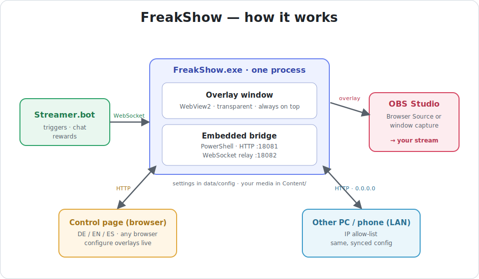
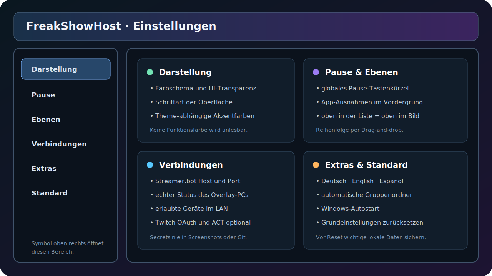

# FreakShow – Handbuch

> **Sicherheit:** Zugangsdaten, OAuth-Tokens, Passwörter und persönliche Widget-Links gehören niemals in Git. Persönliche Konfigurationen und Medien werden durch die mitgelieferte `.gitignore` ausgeschlossen.

FreakShow verbindet eine transparente Windows-Overlay-Ausgabe mit einer lokalen Steuerungsseite. Videos, Bilder, Notizen, Emoji-Regen und externe Web-Overlays werden an einer Stelle verwaltet und können optional durch Streamer.bot ausgelöst werden.

## Schnellstart

1. `FreakShow.exe` starten. Overlay, lokaler Webserver und Bridge starten gemeinsam.
2. Die Steuerung lokal unter `http://127.0.0.1:18081/` öffnen. Ein Doppelklick auf das Tray-Symbol öffnet dieselbe Seite.
3. Oben Monitorformat, Breite/Höhe und bei mehreren Bildschirmen den Zielbildschirm festlegen.
4. **Overlay-Ausgabe** einschalten.
5. Über das Symbol oben rechts **Einstellungen → Verbindungen** öffnen und Streamer.bot einrichten.
6. Medien ausschließlich über die Oberfläche hinzufügen oder in der vorgesehenen `Content/`-Struktur ablegen.

Nur eine Instanz von FreakShow starten. Port `18081` darf nicht gleichzeitig von einer alten Bridge oder einer zweiten Instanz benutzt werden.

## Oberfläche

### Gemeinsame Kopfleiste

- **Monitor:** Preset für 720p, Full HD, 1440p, Ultrawide, 4K oder eine eigene Größe.
- **Breite/Höhe:** Aktiv bei einer eigenen Monitorgröße.
- **Bildschirm:** Zielmonitor der echten Overlay-Ausgabe; erscheint nur bei mehreren Monitoren.
- **Overlay-Ausgabe:** Globaler Hauptschalter. Er blendet die Ausgabe aus, beendet aber weder Software noch Bridge.
- **Chat/Effekt:** Rechte Seitenleiste für Twitch-Chat und globale Emoji-Effektwerte.

## Arbeitsbereiche

### Videos

- Mit **Gruppe +** Gruppen erstellen; mit **+** ein Video hinzufügen.
- Gruppen und Einträge lassen sich sortieren, ein-/ausklappen und einzeln aktivieren.
- Die Vorschau lädt nur das ausgewählte Video. Das hält große Bibliotheken schnell und speicherschonend.
- **Bildschirm füllen** schneidet bei Bedarf zu; ausgeschaltet bleibt das Seitenverhältnis erhalten.
- Der Trigger kann als Streamer.bot-Custom-Event oder – sofern angeboten – als Twitch-Reward verwendet werden.
- Zeitleiste, Lautstärke, Farbtoleranz und Chroma-Key werden pro Video gespeichert.
- **Im Overlay zeigen** startet unmittelbar. Parallel ausgelöste Inhalte dürfen sich überschneiden.
- **Streamer.bot-Code** erzeugt einen passenden C#-Baustein für eine Streamer.bot-Action.

### Notizen

- Für Raid-Notizen, Rotationen, Checklisten, Tabellen und kurze Spielhilfen.
- Unterstützt Mini-Markdown, unter anderem Überschriften, Listen, Tabellen und Emoji.
- Textfeld und Vorschau zeigen dieselbe Formatierung.
- Hintergrundbild oder Rahmenfarbe können getrennt aktiviert werden.
- Rechtsklick im Texteditor öffnet Hilfen, darunter die Auswahl verfügbarer Streamer.bot-Variablen.
- Größe, Breite, Text- und Hintergrundtransparenz sowie Position werden pro Notiz gespeichert.
- Ein Custom-Event blendet die Notiz ein; dasselbe Event kann sie wieder ausblenden.

### Roter Teppich

- Nutzer werden in Gruppen organisiert und separat aktiviert.
- Profilbild oder ein eigenes Bild kann als Effektquelle verwendet werden.
- Form, Animation, Farbe, Namensposition, Bildgröße, Anzahl und Transparenz sind einstellbar.
- Der Triggername entspricht standardmäßig dem Nutzernamen.
- **Regen testen** prüft die Vorschau, ohne Streamer.bot konfigurieren zu müssen.

### Bilder

- Unterstützt Bilder, GIF und APNG.
- Gruppen dienen zugleich als Ebenen-/Kompositionshilfe; mehrere Bilder können gemeinsam im Monitor erscheinen.
- Position und Größe lassen sich direkt im Monitor ziehen und skalieren.
- **Original** erhält die Farben, **Einfärben** tönt das Bild mit der gewählten Farbe.
- Der Positionsschalter zeigt nur die Position in der echten Ausgabe. Er aktiviert den Trigger nicht automatisch.
- In **Einstellungen → Ebenen** wird festgelegt, welches Element andere Inhalte überdeckt.

### Overlays

- Externe Widget- oder Overlay-Links hinzufügen und in Gruppen organisieren.
- FreakShow erkennt bekannte Anbieter und ergänzt geeignete Streamer.bot-Verbindungsparameter.
- ChatRD-, Tawmae- und MustachedManiac-Vorschauen laufen dateilos über FreakShow: Die Seite wird nur in den Arbeitsspeicher geladen, nicht als lokale HTML-Datei gespeichert.
- Dauerhafte Overlays bleiben sichtbar; nicht dauerhafte Overlays werden gezielt ausgelöst.
- Feld-Presets und X/Y/B/H bestimmen den Ausschnitt auf dem Zielmonitor.
- Bei unbekannten Anbietern kann die Vorschau auf einem anderen PC wegen Browser-Sicherheitsregeln „nicht verbunden“ anzeigen, obwohl die echte Host-Ausgabe verbunden ist. Maßgeblich ist der Status **Overlay-PC ↔ Streamer.bot**.

### Diagnose

- Zeigt erreichbare Dienste, WebSocket-Zustand, Konfiguration und Laufzeitmeldungen.
- **Log kopieren** nur für lokale Fehlersuche verwenden. Vor dem Teilen IPs, Namen, Links und Tokens prüfen.
- Laufzeitprotokolle liegen im Ordner `Logs/` und werden nicht in Git eingecheckt.

## Einstellungen

### Darstellung

- Farbschema und Transparenz der Bedienoberfläche.
- Schriftart für Menüs und Einstellungen; Codefelder bleiben Monospace.
- Farben folgen dem gewählten Theme, funktionale Statusfarben bleiben erkennbar.

### Pause

- Globales Tastenkürzel zum Ein-/Ausblenden der Overlay-Ausgabe, auch während ein Spiel fokussiert ist.
- **App-Ausnahmen:** Ist eine eingetragene Anwendung im Vordergrund, werden alle Overlays ausgeblendet. Beim Wechsel zurück ins Spiel werden sie wieder sichtbar.

### Ebenen

- Oben in der Liste bedeutet oben im Bild.
- Einträge per Drag-and-drop sortieren.
- Die Änderung wirkt nach der Synchronisierung in der echten Overlay-Ausgabe.

### Verbindungen

- Streamer.bot Host und WebSocket-Port.
- Echter Hoststatus des Overlay-PCs.
- Erlaubte Geräte für LAN-Zugriff.
- Optionale Twitch-OAuth-Anmeldung und ACT/OverlayPlugin-WebSocket.
- Vollständige Anleitung: [Verbindungen einrichten](CONNECTIONS.md).

### Extras

- Bedienoberfläche auf Deutsch, Englisch oder Spanisch.
- Automatische Gruppenordner für Videos.
- Windows-Autostart.
- Optionaler Game-Event-Reiter für zukünftige Funktionen.

### Standard

Setzt Darstellung, Hintergrund und Sprache zurück. Vorher bei wichtigen Einstellungen die Konfigurationsdaten außerhalb von Git sichern.

## Automatische Updates

Im Tray-Menü mit **Nach Updates suchen** wird die stabile Versionsdatei des öffentlichen
FreakShow-Repositories geprüft. Ist eine neuere Version verfügbar, erfolgt die Installation erst
nach einer ausdrücklichen Bestätigung.

1. Das kleinere Update-ZIP wird in `Updates/` geladen.
2. FreakShow vergleicht die vollständige SHA-256-Prüfsumme mit dem veröffentlichten Manifest.
3. Ein separater Update-Helfer wartet, bis FreakShow vollständig beendet wurde.
4. Nur freigegebene Programmdateien und `app/` werden ersetzt.
5. FreakShow startet automatisch neu und meldet die erfolgreich installierte Version.

`Content/`, `data/`, `Logs/` und `WebView2UserData/` sind technisch vom Update ausgeschlossen.
Vor dem Austausch entsteht unter `Updates/backup-*` eine Sicherung. Scheitert das Kopieren, wird
automatisch zurückgerollt. Die zwei jüngsten Sicherungen bleiben erhalten. Der portable
FreakShow-Ordner muss für den angemeldeten Windows-Nutzer beschreibbar sein.

## Speicherung und Ordner

| Bereich | Zweck | Git |
|---|---|---|
| `app/` | Bedienoberfläche und JavaScript | versioniert |
| `Content/` | persönliche Medien und Laufzeit-Assets | ignoriert |
| `data/config/` | lokale Verbindungen und Einstellungen | ignoriert |
| `data/state/` | synchronisierter UI-Zustand | ignoriert |
| `Logs/` | Host- und Bridge-Protokolle | ignoriert |
| `Updates/` | Downloads und maximal zwei Rollback-Sicherungen | ignoriert |
| `docs/` | Handbuch, sichere Screenshots und Diagramme | versioniert |

## Wichtige Hinweise

- Private IP-Adressen wie `192.168.x.x` sind keine Passwörter, sollten in öffentlichen Screenshots aber trotzdem neutralisiert werden.
- Streamer.bot-Passwort, Twitch-Client-ID, OAuth-Token und persönliche Streamlabs/StreamElements-Widget-Links niemals committen.
- Vor jedem Push `git status` und `git diff --cached` prüfen.
- Persönliche Medien nicht veröffentlichen; die `.gitignore` ist dafür bereits vorbereitet.

Weitere Hilfe: [Fehlerbehebung](TROUBLESHOOTING.md)
